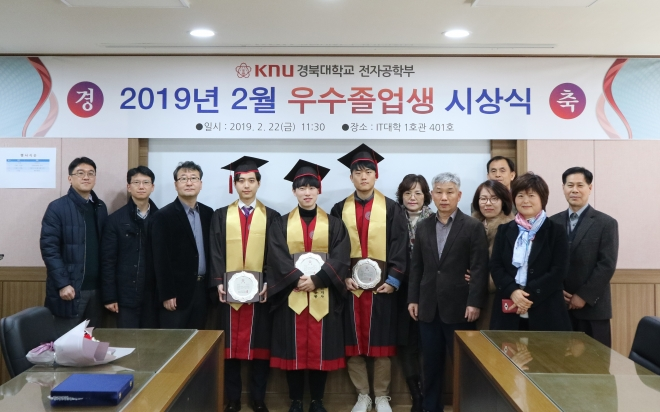
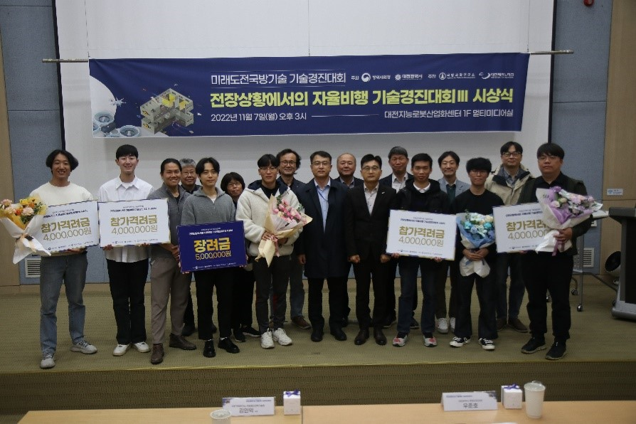
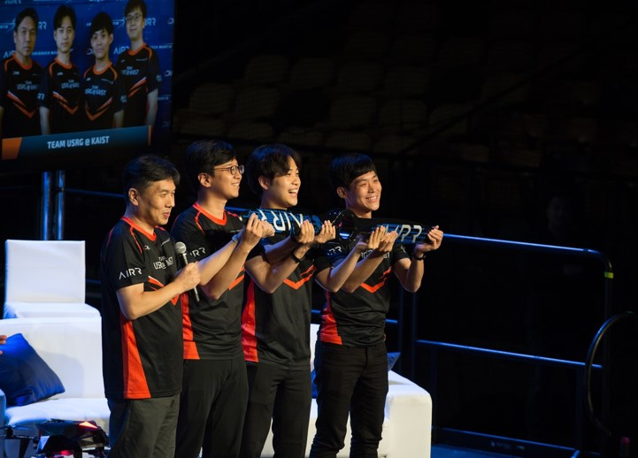
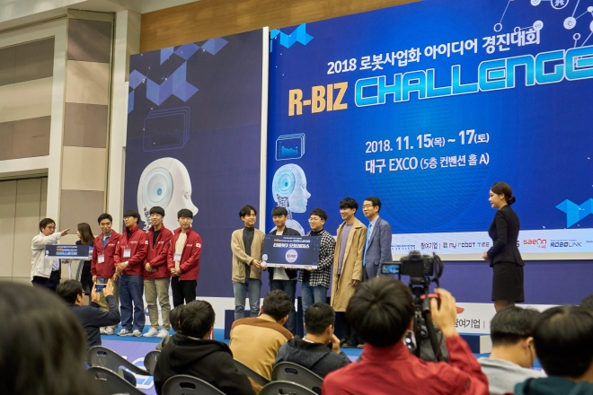

    

## Interest 😮

* **Unmanned Aerial Vehicle, Exploration, Obstacle avoidance, Coverage Path Planning**
* **Control, LiDAR(Visual)-Inertial Odometry, SLAM, Active SLAM**

---

## 🛠 Skills 🛠

  
  
  
  
  
  
   
  
  
  
  
  

---

## Education

* **PhD student, Electrical Engineering** in KAIST
    * 2021.03 ~ ***Current***
    * Studying at: [URL](http://urobot.kaist.ac.kr)
* **Master, Electrical Engineering** in KAIST
    * 2019.02 ~ 2021.02
    * Studied at: [URL](http://urobot.kaist.ac.kr)
* **Bachelor, School of Electronics Engineering** in KyungPook National University
    * 2012.03 ~ 2019.02
    * Studied at: [PI Lab](https://control.knu.ac.kr)

---

## Activities
* 2022.12 - **2022 UVS Symposium: Invited talk**
    * **"How we won Autonomous Flight Competition in Battlefield Situations"**
* 2021.11 - **KBS 중견만리 시즌3**
    * [**"6회 - 로봇 인류와의 공존"**](https://program.kbs.co.kr/1tv/culture/bizinsight/pc/index.html), 미래컴퍼니 협업
    
---

## Honors
* 2019.02 - **The right person of University**
    * **Grand Prize ($2,000)**
    * from **SmartKey-KyungPook Natl. Univ. (Smart Electronics Specialization Projects from CK-1 of Korea)**
* 2019.02 - **Best Graduates of The Year**
    * **2nd Prize/354, (GPA 4.23/4.3)**
    * from **School of Electronics Engineering, KyungPook Natl. Univ.**
    * Articles: [Link](http://see.knu.ac.kr/content/board/news.html?pg=vv&fidx=95709&gtid=bodo&opt=&sword=&page=2)
    
    

        <figure align="center">
        
        <figcaption style="text-align:center;"> Best Graduates Awards Ceremony </figcaption>
        </figure>
    

    
---

## Awards

* 2022.10 - **2022 Autonomous Flight Competition in Battlefield Situations**
    * **Only one team that finished the course, (Team QAIST++)**
    * from **Agency for Defense Development (ADD)**
    * Videos: [Youtube](https://youtu.be/bX2ZsTqsRfY)
    * Articles: [Link1](https://ee.kaist.ac.kr/research-achieve/명현-교수-연구팀-2022년-미래도전-국방기술-경진대회/)
    
    

        <figure align="center">
        
        <figcaption style="text-align:center;"> 2022 ADD Autonomous Flight Competition in Battlefield Situations Awards Ceremony</figcaption>
        </figure>
    

* 2019.12 - **2019 AIRR AlphaPilot (Artificial Intelligence Robotic Racing)**
    * **3rd Prize/424, (Team USRG@KAIST)**
    * from **Lockheed Martin, The Drone Racing League, NVIDIA**
    * Homepages: [Link(LockHeed)](https://www.lockheedmartin.com/en-us/news/events/ai-innovation-challenge.html), [Link(DRL)](https://thedroneracingleague.com/airr/), [Link(HeroX)](https://www.herox.com/alphapilot/community)
    * Videos: [Preliminary-FlightGoggles](https://youtu.be/XMyiNlIbDXU), [RACE1-Orlando](https://youtu.be/kTKeN2SluxU), [RACE1-Orlando2](https://www.facebook.com/plugins/video.php?href=https%3A%2F%2Fwww.facebook.com%2Flockheedmartin%2Fvideos%2F394882387857530%2F&show_text=0&width=560), [Racing Recap PlayLists](https://www.youtube.com/playlist?list=PLvgPHeVm_WqKPy-59Svi-0KEN_pDGedS_)
    * Articles: [Link-1](https://www.lockheedmartin.com/en-us/news/events/ai-innovation-challenge.html), [Link-2](https://biz.chosun.com/site/data/html_dir/2019/06/02/2019060201686.html)
    
    

        <figure align="center">
        
        <figcaption style="text-align:center;"> 2019 AIRR AlphaPilot Awards Ceremony of 1st race in Orlando </figcaption>
        </figure>
    

    
* 2018.11 - **2018 R-BIZ Challenge Turtlebot3 Autorace**
    * **Mathworks Korea Special Prize ($1,000), (EungChang-Ho)**
    * from **ROBOTIS, MathWorks Korea, ICROS, KIRIA, MOTIE**
    * Articles: [Link-1](https://www.edaily.co.kr/news/read?newsId=01915526619407032&mediaCodeNo=257), [Link-2](http://see.knu.ac.kr/content/board/news.html?pg=vv&fidx=95371&gtid=bodo&opt=&sword=&page=2)
    
    

        <figure align="center">
        
        <figcaption style="text-align:center;"> 2018 R-BIZ Challenge Awards Ceremony </figcaption>
        </figure>
    

