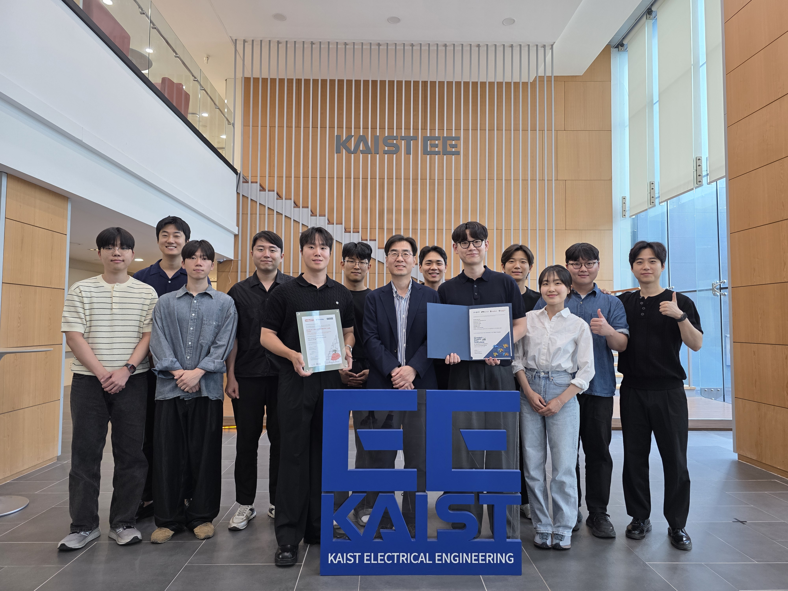
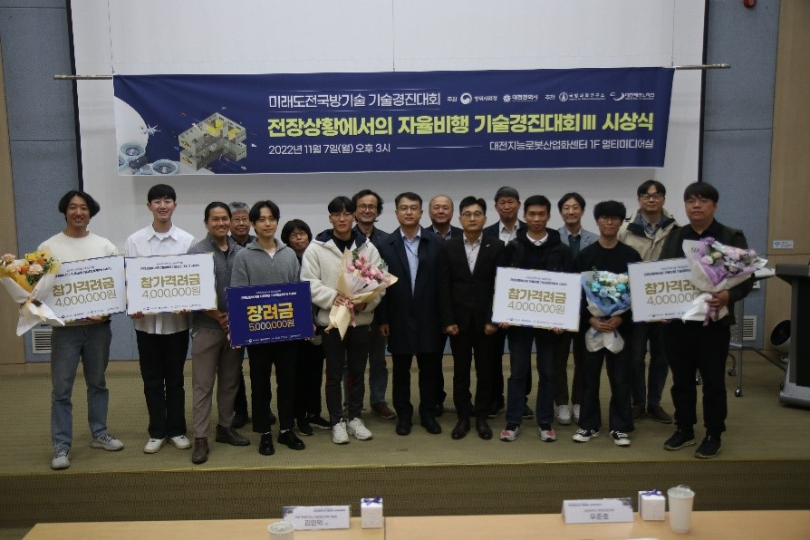
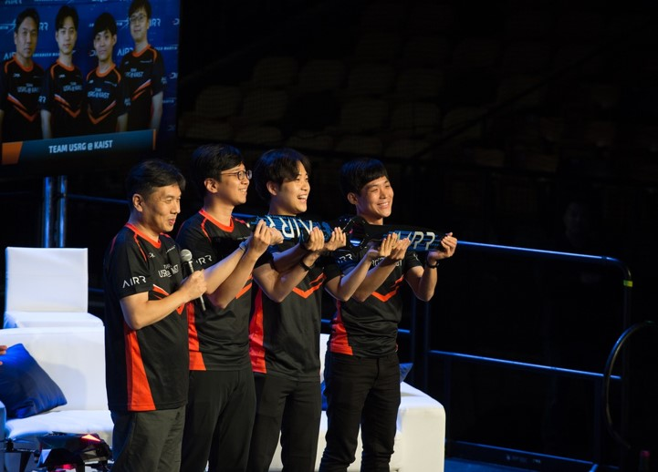
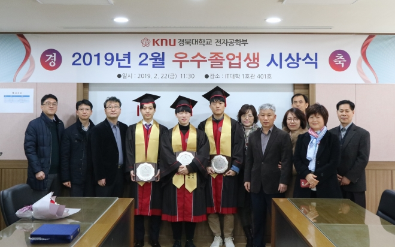
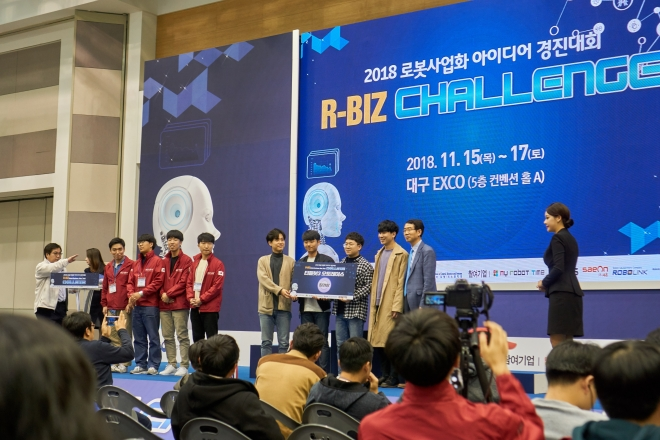

## 📖 Biography

I am a [visiting researcher](https://www.ri.cmu.edu/ri-people/eungchang-lee/) at the [Robotics Institute](https://www.ri.cmu.edu/) at [Carnegie Mellon University](https://www.cmu.edu/), working with Prof. [Sebastian Scherer](https://www.ri.cmu.edu/ri-faculty/sebastian-scherer/) in the [AirLab](https://theairlab.org/). Before joining CMU, I was a postdoctoral researcher at [KAIST](https://www.kaist.ac.kr/), where I received my M.S. and Ph.D. in Electrical Engineering under the supervision of Prof. [Hyun Myung](https://urobot.kaist.ac.kr/url_teams/prof-hyunmyung/) in the [Urban Robotics Lab](http://urobot.kaist.ac.kr/).

My research aims to develop **end-to-end autonomy for UAVs** that can operate reliably in large-scale, GNSS-denied, and unstructured environments. I develop tightly integrated methods spanning **exploration, sensor-fusion-based robust odometry, SLAM, and active SLAM**, with an emphasis on **field-deployable systems for mapping, inspection, and reconnaissance**.

---

## 👨🏻‍💼 Experience

* **Visitor, Robotics Institute** in CMU
    * 2026.07 ~ **Current** - [AirLab](https://theairlab.org/)
* **Postdoc, School of Electrical Engineering** in KAIST
    * 2025.08 ~ 2026.06 - [URL](http://urobot.kaist.ac.kr)

---

## 🎓 Education

* **Ph.D., School of Electrical Engineering** in KAIST
    * 2021.03 ~ 2025.08 - Studied at: [URL](http://urobot.kaist.ac.kr)
* **Master, School of Electrical Engineering** in KAIST
    * 2020.02 ~ 2021.02 - Studied at: [URL](http://urobot.kaist.ac.kr)
    * 2019.02 ~ 2020.01 - Studied at: [USRG](http://unmanned.kaist.ac.kr/)
* **Bachelor, School of Electronics Engineering** in Kyungpook National University
    * 2012.03 ~ 2019.02 - Studied at: [PI Lab](https://control.knu.ac.kr)

---

## 🤸 Activities 
* 2025.09 ~ **Current** - Associate Editor (AE), Intelligent Service Robotics (ISR) (SCIE)
* 2024.10 - **KETI Invited Seminar**
    * "GNSS 음영 상황에서 자율비행 무인비행체를 이용한 실내외 맵핑 및 내비게이션"
* 2022.12 - **2022 UVS Symposium Invited Talk**
    * "How we won Autonomous Flight Competition in Battlefield Situations"
    
---

## 👑 Honors & Awards 🏆

* **Best paper awards**: Five conference papers and one journal paper

* 2026.06 - **2026 Nothing Stands Still Challenge**
    * **1st Place, (Team CuRaytor)**
    * presented at **CVPR 2026**
    * Homepage: [Challenge](https://www.nothing-stands-still.com/challenge), [CVPR 2026](https://cvpr.thecvf.com/Conferences/2026)

    

        <figure align="center">
        
        <figcaption style="text-align:center;"> 2026 CVPR NSS Challenge team CuRaytor (and 2026 ICRA HILTI winner)</figcaption>
        </figure>
    

* 2022.10 - **2022 Autonomous Flight Competition in Battlefield Situations**
    * **Only one team that finished the course, (Team QAIST++)**
    * from **Agency for Defense Development (ADD)**
    * Videos: [Youtube](https://youtu.be/bX2ZsTqsRfY)
    * Articles: [Link1](https://ee.kaist.ac.kr/research-achieve/명현-교수-연구팀-2022년-미래도전-국방기술-경진대회/)
    
    

        <figure align="center">
        
        <figcaption style="text-align:center;"> 2022 ADD Autonomous Flight Competition in Battlefield Situations Awards Ceremony</figcaption>
        </figure>
    

* 2019.12 - **2019 AIRR AlphaPilot (Artificial Intelligence Robotic Racing)**
    * **3rd Prize/424, (Team USRG@KAIST)**
    * from **Lockheed Martin, The Drone Racing League, NVIDIA**
    * Homepages: [Link(LockHeed)](https://www.lockheedmartin.com/en-us/news/events/ai-innovation-challenge.html), [Link(DRL)](https://thedroneracingleague.com/airr/), [Link(HeroX)](https://www.herox.com/alphapilot/community)
    * Videos: [Preliminary-FlightGoggles](https://youtu.be/XMyiNlIbDXU), [RACE1-Orlando](https://youtu.be/kTKeN2SluxU), [RACE1-Orlando2](https://www.facebook.com/plugins/video.php?href=https%3A%2F%2Fwww.facebook.com%2Flockheedmartin%2Fvideos%2F394882387857530%2F&show_text=0&width=560), [Racing Recap PlayLists](https://www.youtube.com/playlist?list=PLvgPHeVm_WqKPy-59Svi-0KEN_pDGedS_)
    * Articles: [Link-1](https://www.lockheedmartin.com/en-us/news/events/ai-innovation-challenge.html), [Link-2](https://biz.chosun.com/site/data/html_dir/2019/06/02/2019060201686.html)
    
    

        <figure align="center">
        
        <figcaption style="text-align:center;"> 2019 AIRR AlphaPilot Awards Ceremony of 1st race in Orlando </figcaption>
        </figure>
    

* 2019.02 - **The right person of University**
    * **Grand Prize ($2,000)**
    * from **SmartKey-Kyungpook Natl. Univ. (Smart Electronics Specialization Projects from CK-1 of Korea)**
* 2019.02 - **Best Graduates of The Year**
    * **2nd Prize/354, (GPA 4.23/4.3)**
    * from **School of Electronics Engineering, Kyungpook Natl. Univ.**
    * Articles: [Link](http://see.knu.ac.kr/content/board/news.html?pg=vv&fidx=95709&gtid=bodo&opt=&sword=&page=2)
    
    

        <figure align="center">
        
        <figcaption style="text-align:center;"> Best Graduates Awards Ceremony </figcaption>
        </figure>
    

* 2018.11 - **2018 R-BIZ Challenge Turtlebot3 Autorace**
    * **Mathworks Korea Special Prize ($1,000), (Team EungChang-Ho)**
    * from **ROBOTIS, MathWorks Korea, ICROS, KIRIA, MOTIE**
    * Articles: [Link-1](https://www.edaily.co.kr/news/read?newsId=01915526619407032&mediaCodeNo=257), [Link-2](http://see.knu.ac.kr/content/board/news.html?pg=vv&fidx=95371&gtid=bodo&opt=&sword=&page=2)
    
    

        <figure align="center">
        
        <figcaption style="text-align:center;"> 2018 R-BIZ Challenge Awards Ceremony </figcaption>
        </figure>
    

