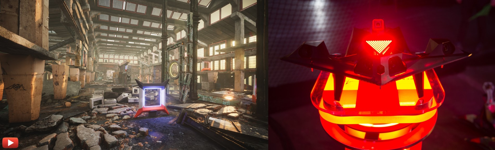
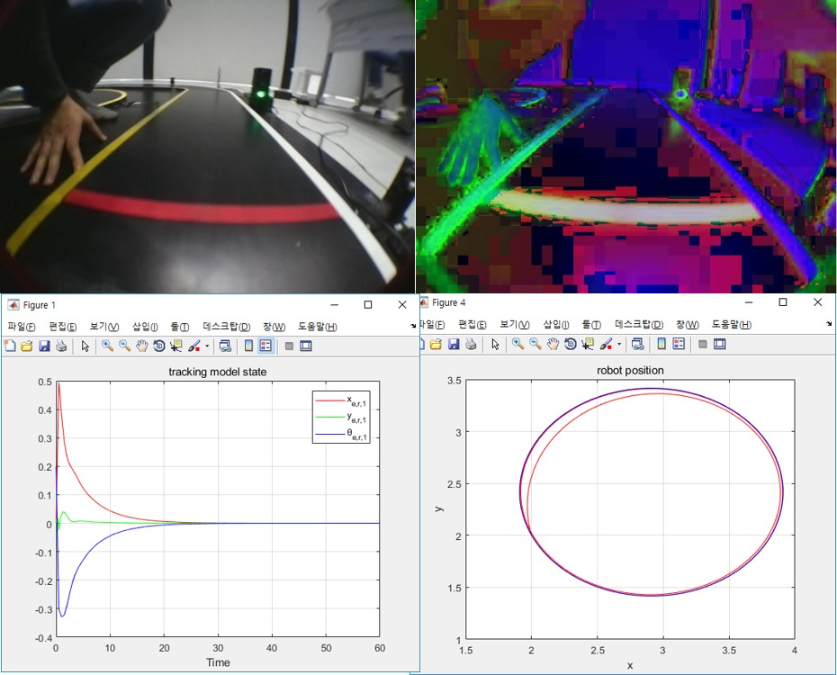
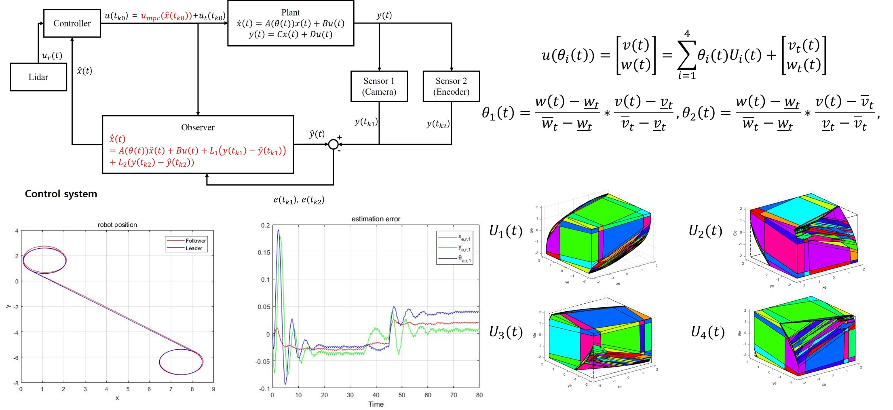

# Projects

####  Unfold to see the details 

---

---

## Laboratory Projects

#### ※ Development of Drone System for Diagnosis of Porcelain Insulators in Overhead Transmission Lines

  
 Click to fold/unfold 

  

  * *Supported by [KEPCO](https://home.kepco.co.kr/kepco/EN/main.do) and [KEPRI](https://www.kepri.re.kr:20808/index)*
  * ***This project was counducted at Urban Robotics Lab in KAIST:  [Link](http://urobot.kaist.ac.kr/)***
  * **I participated in this project during: 2023.01 - 2024.06**

  

  

  　In this project, we develop a autonomous drone manipulation framework for diagnosis of porcelain insulators in transmission lines. We are developing a robust multi-LiDAR SLAM, real-time obstacle avoidance path planner, and adaptive attitude / trajectory tracking controllers.
  

 
  

  ***Keywords***: Drone, Quadrotor UAV, Manipulation, Drone Manipulation, Aerial Inspection, Multi-LiDAR SLAM
  

  

  <iframe width="560" height="315" src="https://www.youtube.com/embed/YQmjKMoBPNU" title="YouTube video player" frameborder="0" allow="accelerometer; autoplay; clipboard-write; encrypted-media; gyroscope; picture-in-picture" allowfullscreen></iframe>
  

 

#### ※ Research of Coverage Path Planner for 3D Reconstruction with UAVs

  
 Click to fold/unfold 

  

  * *Supported by Confidential* 
  * ***This project was counducted at Urban Robotics Lab in KAIST:  [Link](http://urobot.kaist.ac.kr/)***
  * **I participated in this project in 2022**

  

  

  　In this project, we developed a energy-efficient and obstacle-aware coverage path planner for UAVs to accurately reconstruct the target structures with high-resolution. The detailed information is confidential.
  

 
  

  ***Keywords***: Drone, Quadrotor UAV, Coverage Path Planning, 3D Reconstruction, Obstacle avoidance, Exploration, SLAM
  

  

  <iframe width="560" height="315" src="https://www.youtube.com/embed/wqcitpoNW68" title="YouTube video player" frameborder="0" allow="accelerometer; autoplay; clipboard-write; encrypted-media; gyroscope; picture-in-picture" allowfullscreen></iframe>
  

 

#### ※ 2022 ADD Autonomous Flight Competition in Battlefield Situations

  
 Click to fold/unfold 

  

  * *Hosted by [Agency for Defense Development (ADD)](https://www.add.re.kr/) - [Link](https://ee.kaist.ac.kr/research-achieve/%EB%AA%85%ED%98%84-%EA%B5%90%EC%88%98-%EC%97%B0%EA%B5%AC%ED%8C%80-2022%EB%85%84-%EB%AF%B8%EB%9E%98%EB%8F%84%EC%A0%84-%EA%B5%AD%EB%B0%A9%EA%B8%B0%EC%88%A0-%EA%B2%BD%EC%A7%84%EB%8C%80%ED%9A%8C/)* 
  * ***This project was counducted at Urban Robotics Lab in KAIST:  [Link](http://urobot.kaist.ac.kr/)***
  * **I participated in this project during: 2022.05 - 2022.10**

  

  

  　The competition aims to develop an autonomous drone to pass through complex and dangerous outdoor obstacles, infiltrate an unknown two-story building, detect hidden targets, create precise 3D maps including target types and coordinates, and return to the starting point safely. I developed main framework including local/global path planners, 3D map logger with the detected target positions and a decision-making system.
  

 
  

  ***Keywords***: Drone, Quadrotor UAV, Competition, Obstacle avoidance, Exploration, Object Detection, SLAM
  

  

  <iframe width="560" height="315" src="https://www.youtube.com/embed/bX2ZsTqsRfY" title="YouTube video player" frameborder="0" allow="accelerometer; autoplay; clipboard-write; encrypted-media; gyroscope; picture-in-picture" allowfullscreen></iframe>
  

 

#### ※ IEEE UAV Competition 2022 - Low Power Computer Vision Challenges (LPCVC): Chase

  
 Click to fold/unfold 

  

  * *Hosted by [LPCV](https://lpcv.ai/) and IEEE - [Link](https://ri4rover.org/)* 
  * *Source code of this project is available at [Github](https://github.com/engcang/ieee_uav_2022)*
  * ***This project was counducted at Urban Robotics Lab in KAIST:  [Link](http://urobot.kaist.ac.kr/)***
  * **I participated in this project during: 2022.01 - 2022.02**

  

  

  　Low Power Computer Vision Challenges aims to develop light and fast computer vision solutions to be used in many fields including Robotics. In 2022, the goals of the competition was to track the non-uniform motion vehicle at constant distance away with a quadrotor UAV, while avoiding obstacles. We estimated the trajectory of the moving vehicle in the form of 5th order polynomial using the detected center point with YOLO network. Then, Adaptive weight Model Predictive Controller (AMPC) is designed to track the target effectively.
  

 
  

  ***Keywords***: Quadrotor, Drone Competition, Target Tracking, Object Detection, Machine Learning, Computer Vision, Path planning
  

  

  <iframe width="560" height="315" src="https://www.youtube.com/embed/zObqq5_M4UA" title="YouTube video player" frameborder="0" allow="accelerometer; autoplay; clipboard-write; encrypted-media; gyroscope; picture-in-picture" allowfullscreen></iframe>
  

 

#### ※ Unmanned Swarm CPS Research Lab

  
 Click to fold/unfold 

  

  * *Supported by [ADD](https://www.add.re.kr/kps)*
  * ***This project was counducted at Urban Robotics Lab in KAIST:  [Link](http://urobot.kaist.ac.kr/)***
  * **I participated in this project during: 2021.1 - 2021.12**

  

  

  　In this project, we developed adaptive multi robot localization method. With the high fidelity networking, artificial intelligent cooperative control, and mobile ground control station, unmanned swarm system has been researched to operate cyber-physical systems.

  

***Keywords***: Multi-robot systems, Cyber-Physical System, Multi-robot localization, Simultaneously Localization and Mapping
  

  

      <iframe width="560" height="315" src="https://www.youtube.com/embed/hFSMSx3LP70" title="YouTube video player" frameborder="0" allow="accelerometer; autoplay; clipboard-write; encrypted-media; gyroscope; picture-in-picture" allowfullscreen></iframe>
  

 

#### ※ Autonomous Drone Navigation for Power Line Inspection in Underground

  
 Click to fold/unfold 

  

  
  * *Supported by [KEPCO](https://home.kepco.co.kr/kepco/EN/main.do) and [KEPRI](https://www.kepri.re.kr:20808/index)*
  * ***This project was counducted at Urban Robotics Lab in KAIST:  [Link](http://urobot.kaist.ac.kr/)***
  * **I participated in this project during: 2020.8 - 2022.12**

  

  

  　In this project, we developed indoor SLAM, navigation, and exploration method to operate an UAV exploring the underground power line tunnel safely. In consideration with the limited payload and computational resource of the UAV, the precomputed and lightweight local exploration planner was proposed. Additionally, to charge the battery of the UAV on the UGV with the docking station, relative pose estimation EKF and autonomous landing algorithm was developed.

  

***Keywords***: Unmanned Aerial Vehicle, Exploration, Structural Inspection, Underground Navigation
  

  

      <iframe width="448" height="252" src="https://www.youtube.com/embed/S3XAOMek2mo" title="YouTube video player" frameborder="0" allow="accelerometer; autoplay; clipboard-write; encrypted-media; gyroscope; picture-in-picture" allowfullscreen></iframe>
      <iframe width="448" height="252" src="https://www.youtube.com/embed/2nyaDcgCnaw" title="YouTube video player" frameborder="0" allow="accelerometer; autoplay; clipboard-write; encrypted-media; gyroscope; picture-in-picture" allowfullscreen></iframe>
  

    

 

#### ※ A Study on the Visual-Inertial Navigation System of Artificial Intelligent Unmanned Aerial Vehicle for Reconnaissance and Exploration

  
 Click to fold/unfold 

  

  * *Hosted by [ROND](http://rond.or.kr/CmsHome/MainDefault.aspx) in KAIST*
  * ***This project was counducted at Urban Robotics Lab in KAIST:  [Link](http://urobot.kaist.ac.kr/)***
  * **I participated in this project during: 2020.5 - 2020.11**

  

  

  　Research on Unmanned Aerial Vehicles has been actively conducted in recent years. In particular, the UAV to explore an unknown, GNSS-denied environment is required, but the self-localization method, such as Visual Inertial Odometry, is mandatory to operate it. Considering the payload and the operating time of the UAV, lightweight and low-power consuming cameras and IMU are preferred, and even Object Detection and 3D Mapping can be obtained using a RGB-D camera. In this work, we developed a 3D Mapping system including object positions in an unknown and GNSS-denied environment for the UAV with a RGB-D camera. The system is demonstrated in Gazebo simulator, and the quantitative and qualitative results are obtained.

  

***Keywords***: Unmanned Aerial Vehicle, Visual-Inertial Navigation System, Exploration, Artificial Intelligence
  

  

      <iframe width="448" height="252" src="https://www.youtube.com/embed/5t-6g7UWA7o" frameborder="0" allow="accelerometer; autoplay; clipboard-write; encrypted-media; gyroscope; picture-in-picture" allowfullscreen>
      </iframe>
  

 

#### ※ 2020 Korea Robot Aircraft Competition

  
 Click to fold/unfold 

  

  * *Hosted by [MOTIE](http://www.motie.go.kr/www/main.do) and [KAIA](http://aerospace.or.kr/eng/main/main.php) - [Link](http://www.koreauav.com/home/)* 
  * ***This project was counducted at Urban Robotics Lab in KAIST:  [Link](http://urobot.kaist.ac.kr/)***
  * **I participated in this project during: 2020.4 - 2020.11**

  

  

  　Korea Robot Aircraft Competition aims to promote the revival of the domestic aviation industry and respond to various demands, this competition will expand the base of unmanned aviation-related technologies through participation in high school and university (graduate) students, and contribute to discovering and fostering human resources in related industries. The competition has been held every year since 2002 for the purpose of raising awareness of unmanned aerial vehicles (drones) and training manpower through various missions using unmanned aerial vehicles (drones) developed by college students. 

 
  

***Keywords***: Quadrotor, Drone Competition, Target Tracking, Object Detection, Machine Learning
  

  

  <iframe width="448" height="252" src="https://www.youtube.com/embed/VslihHATv-8" frameborder="0" allow="accelerometer; autoplay; clipboard-write; encrypted-media; gyroscope; picture-in-picture" allowfullscreen></iframe>
  

 

#### ※ 2019 AIRR AlphaPilot (Artificial Intelligence Robotic Racing)

  
 Click to fold/unfold 

  

  * *Hosted by [Lockheed Martin](https://www.lockheedmartin.com/) and [The Drone Racing League](https://thedroneracingleague.com/), Supported by [NVIDIA](https://www.nvidia.com/en-us/)*
  * ***This project was counducted at Unmanned Systems Research Group in KAIST:  [Link](http://unmanned.kaist.ac.kr)***
  * **I participated in this project during: 2019.3 - 2019.12**
  * ***Relative Media is listed on **About Me**'s Awards***

  

  

  　AlphaPilot is the first large-scale open innovation challenge of its kind focused on advancing artificial intelligence (AI) and autonomy.
  Supported and hosted by DRL, Lockheed Martin and NVIDIA. For the 1 Million dollar prize only for the winner.
  The challenge consists of Preliminary test and Real competition.
  Firstly, DRL and Lockheed martin used FlightGoggles Simulator from MIT to narrow down  424 teams over 81 countries into 9 Qualifiers. 
  Only 9 Qulifiers participated real RACEs using DRL made drone 'RACER AI' which is equipped with RTOS like kernel customized NVIDIA Jetson Xavier and few sensors. Our team won the 3rd prize.
  

  

***Keywords***: Drone, Quadrotor, Autonomous Flying Drones, Drone Racing
  

  

  <iframe src="https://www.facebook.com/plugins/video.php?href=https%3A%2F%2Fwww.facebook.com%2Flockheedmartin%2Fvideos%2F394882387857530%2F&show_text=0&width=560" width="560" height="315" style="border:none;overflow:hidden" scrolling="no" frameborder="0" allowTransparency="true" allowFullScreen="true"></iframe>
  

  

      <figure align="center">
          
          <figcaption style="text-align:center;"> FlightGoggles simulator and RACER-AI drone </figcaption>
      </figure>
  

 

#### ※ 2018 R-BIZ Challenge Turtlebot3 Autorace

  
 Click to fold/unfold 

  

  * *Hosted by [ROBOTIS](https://www.robotis.com/), [MathWorks Korea](https://kr.mathworks.com/) and, [ICROS](http://icros.org/main/), Supported by [KIRIA](https://www.kiria.org/) and [MOTIE](http://www.motie.go.kr/www/main.do) - [Link](https://emanual.robotis.com/docs/en/platform/turtlebot3/challenges/#autorace-rbiz-challenge)*
  * ***This project was counducted at Physical Intelligence Lab in KNU:  [Link](https://control.knu.ac.kr)***
  * **I participated in this project during: 2018.6 - 2018.11**

  

  

  　ROS based autonomous driving system for mobile robot (Turtlebot3) is developed for finishing the racing track with diverse missions. Using MATLAB, Lyapunov functional is proved to stabilize the error model of mobile robot. Simple HOG based Cascade Object Detector is trained using Computer Vision Toolbox of MatLab and then all systems are coded with Python to control the robot in real-time. Only 35 dollar Raspberry Pi computer was adopted and it was equipped with 1-D LiDAR and mono camera. Our team won the Mathworks Korea Special Prize.
  

  

***Keywords***: Mobile Robots, Autonomous Driving Vehicles, Lyapunov function based Control
  

  

      <figure align="center" class="half">
          
          
          <figcaption style="text-align:center;"> Race GIF, Controller design, and Signal&Line detection </figcaption>
      </figure>
  

 

#### ※ Research on Multi-Rate Sensor Fusion based Mobile Robot Model Predictive Control System

  
 Click to fold/unfold 

  

  
  * *Supported by [The Electronics and Telecommunications Research Institute(ETRI)](https://www.etri.re.kr/intro.html)*
  * ***This project was counducted at Physical Intelligence Lab in KNU:  [Link](https://control.knu.ac.kr)***
  * **I participated in this project during: 2018.4 - 2018.12**
  * ***Relative Publication : [Link](https://ieeexplore.ieee.org/abstract/document/8661985/)***

  

  

  　Measured data from Vehicle’s multi sensor system have asynchronized sampling rate,
   The final goal of this research project is to design multi-rate State  Estimator that can assume exact state using asynchronized data. Model based prediction controller is designed to perform at real-time for improving control performance. In addition, ROS based mobile robot data processing system, LiDAR data based path planning, sign recognition algorithm are researched for implementing autonomous system.
  

  

***Keywords***: Sampled-data system, Multi-rate Sampled-data system, Model Predictive Control, Cyber-Physical System
  

  

      <figure align="center">
          
          <figcaption style="text-align:center;"> Overall system: Multi-rate Observer, Controller, and results </figcaption>
      </figure>
  

---

---

## Technology Transfer

+ **Eunchang Lee**, Hyungtae Lim, and Hyun Myung, "Adaptive and robust 3D SLAM method that adjusts parameters depending on the environments, and Application of SLAM method for unmanned aerial vehicle flight in GNSS-denied environments (환경에 적응적으로 해상도를 조절하는 강인한 3차원 SLAM 기술과 위성항법장치 음영상황에서 무인비행체의 비행을 위한 SLAM 기술의 적용)," 2023.05.01.
+ **Eunchang Lee**, Junho Choi, Duckyu Choi, Nahrendra I Made Aswin, Hyungtae Lim, Seunghyun Lee, Seungwon Song, and Hyun Myung, "SLAM-based autonomous flying patrol drone system and remote control interface (SLAM 기반 자율 비행 순찰 드론 시스템 및 원격 제어 인터페이스)," 2023.11.14.

---

---

## Freelancing

#### ※ KHNP Virtual Robot Challenge 2022

  
 Click to fold/unfold 

  

  * *Hosted by [Korea Hydro & Nuclear Power](https://www.khnp.co.kr/) - [Link](https://github.com/Woojin-Seol/KVRC2022), [Link2](https://youtu.be/usKW3UG9wpc)* 
  * *Source code of this competition is available at [Github](https://github.com/Woojin-Seol/KVRC2022)*
  * **I served as a developer and a maintainer for this project during: 2022.09 - 2022.12**

  

  

  　KHNP Virtual Robot Challenge aims to develop a autonomous navigation algorithm and a robust controller to complete diverse and challenging tasks including obstacle avoidance, exploration, and enduring the wind disturbances. I made Gazebo maps for the competition and coded scoring GUI. Additionally, I coded sample controllers for the quadrotor UAV.
  

 
  

  ***Keywords***: Drone, Quadrotor UAV, Competition, Obstacle avoidance, Exploration, Robust Control, Gazebo, Simulation
  

  

  <iframe width="560" height="315" src="https://www.youtube.com/embed/usKW3UG9wpc" title="YouTube video player" frameborder="0" allow="accelerometer; autoplay; clipboard-write; encrypted-media; gyroscope; picture-in-picture" allowfullscreen></iframe>
  

 

#### ※ Palm Tree Field Exploration and Tree Identification with UAV / UGV

  
 Click to fold/unfold 

  

      
  * *Conducted at [AKA-AI Robotics](https://akaintelligence.com/)*
  * **I participated in this project during: 2021.11 - 2022.05**

  

  

  　The final goal of this research project is to develop an exploration system for monitoring unknown palm tree orchard environments while avoid‑
  ing collisions and figuring out appearances of trees. I developed the whole system including pointcloud data processing, path planning, and controller. A state‑of‑the‑art open‑sourced SLAM algorithm is utilized.

 
  

***Keywords***: UAV, UGV, Exploration, Obstacle avoidance, SLAM, Gazebo, Simulation
  

  

  <iframe width="448" height="252" src="https://www.youtube.com/embed/p7n7KhUU_5g" title="YouTube video player" frameborder="0" allow="accelerometer; autoplay; clipboard-write; encrypted-media; gyroscope; picture-in-picture" allowfullscreen></iframe>
  <iframe width="448" height="252" src="https://www.youtube.com/embed/R6GKBVuo3qg" title="YouTube video player" frameborder="0" allow="accelerometer; autoplay; clipboard-write; encrypted-media; gyroscope; picture-in-picture" allowfullscreen></iframe>    
  

 

#### ※ KHNP Virtual Robot Challenge 2021

  
 Click to fold/unfold 

  

      
  * *Hosted by [Korea Hydro & Nuclear Power](https://www.khnp.co.kr/) - [Link](https://github.com/Woojin-Seol/KVRC2021), [Link2](https://youtu.be/6oXx2bvzU9Y)*
  * *Source code of this competition is available at [Github](https://github.com/Woojin-Seol/KVRC2021)*
  * **I served as a developer and a maintainer for this project during: 2021.09 - 2021.12**

  

  

  　KHNP Virtual Robot Challenge aims to develop a autonomous navigation algorithm and a robust controller to complete diverse and challenging tasks including obstacle avoidance, manipulation for grasping a cube, climbing stairs, and enduring the disturbances. I made Gazebo maps for the competition and coded scoring GUI. Additionally, I coded sample controllers for the manipulator and the quadruped robot.

 
  

***Keywords***: Quadruped robots, Competition, Obstacle avoidance, Object Detection, Gazebo, Simulation
  

  

  <iframe width="560" height="315" src="https://www.youtube.com/embed/6oXx2bvzU9Y" title="YouTube video player" frameborder="0" allow="accelerometer; autoplay; clipboard-write; encrypted-media; gyroscope; picture-in-picture" allowfullscreen></iframe>
  

